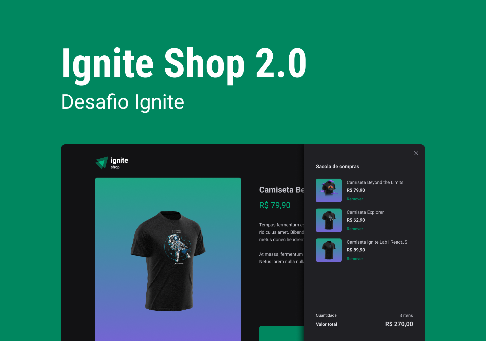
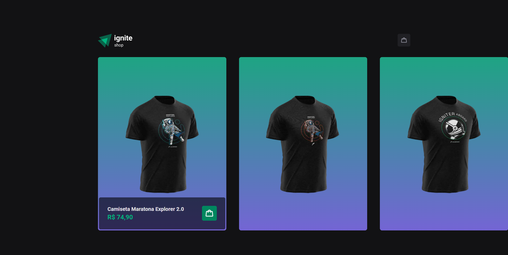
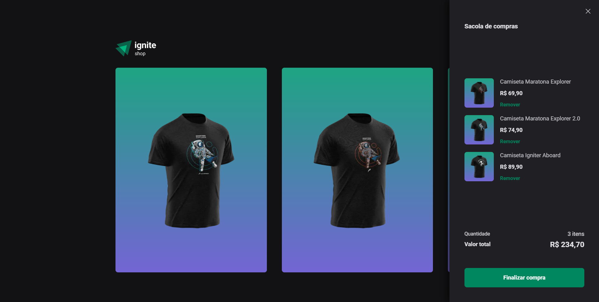
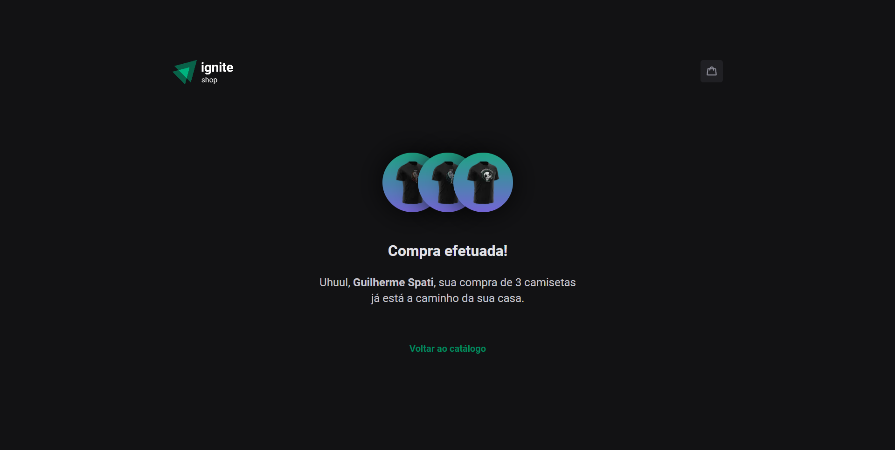

<h1 align="center">
    
</h1>

<span align="center">
    
</span>

Esse projeto simula um e-commerce de uma loja de camisetas fictícia, feita em integração com a API do Stripe e tem como funcionalidades a listagem de produtos, um carrinho de compras onde é possível adicionar ou remover produtos no carrinho, exibir o total de itens e calcular o valor total da soma. Utilizando contextos e rotas com o Next, é possível navegar entre as páginas repassando as informações de entrada do usuário. Neste projeto foram aplicado os conceitos de SSR (Server Side Rendering) e SSG (Static Site Generation) utilizando o Next.

## 🛠️ Construído com

Esse projeto foi desenvolvido com as seguintes tecnologias:

- [Next](https://nextjs.org/)
- [ReactJS](https://reactjs.org)
- [TypeScript](https://www.typescriptlang.org/)
- [Stitches](https://stitches.dev/)
- [Stripe](https://stripe.com/)

### 📋 Pré-requisitos

Para clonar e rodar essa aplicação, será necessário o [Git](https://git-scm.com) e o [Node.js](https://nodejs.org/en/) instalados no seu computador além de configurar um arquivo .env.local contendo os tokens referentes a API do Stripe.

### 🔧 Como usar

```bash
# Clone este repositório
$ git clone https://github.com/guispati/Ignite-Shop.git

# Abra a pasta criada
$ cd Ignite-Shop

# Instale as dependências
$ npm install

# Inicie o projeto
$ npm run dev
```

## 💻 Demonstração

Na tela inicial você pode visualizar os produtos cadastrados e comprar um ou mais produtos adicionando-os ao carrinho de compras:


Ao clicar no ícone do carrinho no topo da página, abrirá o carrinho de compras flutuante, onde é possível visualizar os itens do carrinho e excluí-los. Ao final das alterações, para concluir o seu processo de compra basta clicar no botão Finalizar Compra e você será redirecionado para a página do Stripe para realizar a sua compra no ambiente sandbox do Stripe.


Ao concluir o preenchimento dos seus dados na plataforma do Stripe, você será redirecionado de volta ao site para a tela de sucesso, onde é exibido um resumo da sua compra:


## 📄 Licença

Este projeto está sob a licença MIT - veja o arquivo [LICENSE.md](LICENSE.md) para mais detalhes.

---
⌨️ com ❤️ por [Guilherme Spati](https://github.com/guispati) 😊